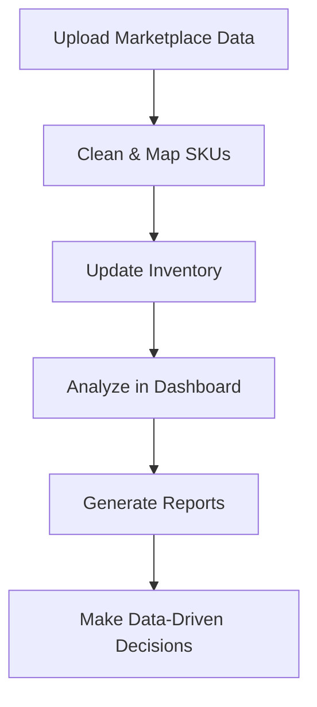

# 🏭 Warehouse Management System (WMS) MVP 🚀


A modern Python-based Warehouse Management System designed to streamline inventory tracking and optimize stock management across multiple marketplaces. This MVP focuses on preprocessing sales data and harmonizing SKU information to provide actionable insights.

## ✨ Key Features

### 📊 Data Management

* **SKU Harmonization** 🔄 - Map marketplace-specific SKUs to Master SKUs (MSKUs)
* **Combo Product Handling** 🧩 - Intelligently process bundle and combo products
* **Multi-Format Support** 📂 - Process CSV, Excel, and JSON from various marketplaces

### 📦 Inventory Control

* **Real-time Tracking** ⏱️ - Automatic inventory updates based on sales data
* **Low Stock Alerts** 🚨 - Customizable thresholds for inventory warnings
* **Inventory Adjustments** ✏️ - Manual stock corrections when needed

### 📈 Analytics & Visualization

* **Interactive Dashboard** 📊 - Sales trends, inventory levels, and performance metrics
* **Marketplace Comparison** ⚖️ - Compare performance across channels
* **Product Performance** 🏆 - Identify best-sellers and underperformers

### 🤖 AI-Powered Insights

* **Natural Language Queries** 💬 - Ask questions in plain English
* **Smart Data Exploration** 🔍 - Discover hidden patterns in your data


## 🛠️ Technology Stack

| Component           | Technology                        |
| ------------------- | --------------------------------- |
| **Backend**         | Python 3.9+                       |
| **Frontend**        | Streamlit                         |
| **Data Processing** | Pandas, NumPy                     |
| **Visualization**   | Plotly                            |
| **Database**        | SQLite (default), Baserow (cloud) |
| **AI Integration**  | Google Gemini API                 |

## 🚀 Getting Started

### 📥 Installation

1. **Clone the repository**:

   ```bash
   git clone https://github.com/your-repo/wms-mvp.git
   cd wms-mvp
   ```

2. **Set up virtual environment**:

   ```bash
   # Windows
   python -m venv venv
   venv\Scripts\activate
   # macOS/Linux
   python -m venv venv
   source venv/bin/activate
   ```

3. **Install dependencies**:

   ```bash
   pip install -r requirements.txt
   ```

4. **Initialize directories**:

   ```bash
   mkdir -p data/{raw,processed,mappings} logs
   ```

5. **Launch the application**:

   ```bash
   streamlit run app.py
   ```

6. **Access the dashboard** at `http://localhost:8501`

## 🗃️ Database Configuration

### Option 1: SQLite (Default) 🗄️

* Zero-configuration local database
* Automatically created at `data/wms_database.db`
* Perfect for single-user scenarios

### Option 2: Baserow (Cloud) ☁️

1. **Sign up** at [Baserow.io](https://baserow.io/)
2. **Create tables** for products, SKU mappings, inventory, orders, and order items
3. **Get API token** from account settings
4. **Configure environment**:

   ```env
   DB_API_KEY=your_baserow_token
   DB_TABLE_ID_PRODUCTS=table_id
   DB_TABLE_ID_SKU_MAPPINGS=table_id
   DB_TABLE_ID_INVENTORY=table_id
   DB_TABLE_ID_ORDERS=table_id
   DB_TABLE_ID_ORDER_ITEMS=table_id
   ```
5. **Update config**:

   ```yaml
   database:
     type: baserow
   ```

## 🤖 Google Gemini API Setup

1. **Get API key** from [Google AI Studio](https://makersuite.google.com/app/apikey)
2. **Add to .env**:

   ```env
   GEMINI_API_KEY=your_api_key_here
   ```
3. **Restart** the application

## 🔄 Workflow Overview



## 🛠️ Troubleshooting

| Issue                      | Solution                                |
| -------------------------- | --------------------------------------- |
| Missing dependencies       | Run `pip install -r requirements.txt`   |
| Database connection errors | Verify .env configuration               |
| SKU mapping failures       | Check for special characters in SKUs    |
| Slow performance           | Reduce dataset size or upgrade database |

## 📜 License

MIT License - Free for personal and commercial use

## ✉️ Support

For issues or feature requests, please open an issue on our GitHub repository.

🚀 **Happy Inventory Managing!** Optimize your warehouse operations with ease!
